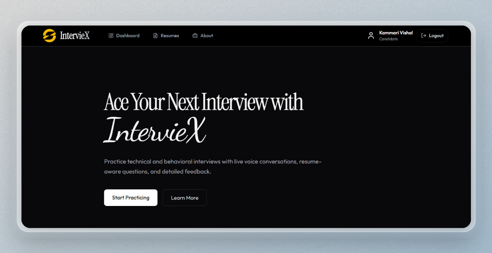

<<<<<<< HEAD
````md
# IntervieX

### AI-Powered Mock Interview Platform

IntervieX is a modern full-stack AI interview preparation platform built with the MERN stack. It simulates realistic technical interviews using AI-generated questions, real-time voice interactions, resume-based personalization, and intelligent performance evaluation.

---


=======
# IntervieX

### AI Powered Mock Interview Platform

IntervieX is a modern full-stack AI interview preparation platform built with the MERN stack. It simulates realistic technical interviews using AI-generated questions, real-time voice interactions, resume-based personalization, and intelligent performance evaluation.

Click the image:

<a href="https://interviex.vercel.app/"> 
  
</a>

---

>>>>>>> e889b24a5669013b8391883753ca2657596f3d70
# Features

## AI-Powered Interview Generation

<<<<<<< HEAD
- Generates personalized technical, behavioral, and scenario-based interview questions
- Tailors questions using uploaded resumes and selected job roles
- Powered by the Gemini API

## Real-Time Voice Interview Experience

- AI asks questions using Sarvam AI Text-to-Speech
- Candidates respond naturally using microphone input
- Speech responses are transcribed using Sarvam AI Speech-to-Text
- Interactive conversation-style interview flow

## Resume Parsing

- Upload resumes in PDF, DOCX, or TXT formats
- Extracts and analyzes content automatically
- Built using `pdf-parse` and `mammoth`

## AI Evaluation Dashboard

- Detailed scoring system (0–100)
- Strength and weakness analysis
- Suggested improvements and sample answers
- Performance insights visualized with charts
=======
* Generates personalized technical, behavioral, and scenario-based interview questions
* Tailors questions using uploaded resumes and selected job roles
* Powered by the Gemini API

## Real-Time Voice Interview Experience

* AI asks questions using Sarvam AI Text-to-Speech
* Candidates respond naturally using microphone input
* Speech responses are transcribed using Sarvam AI Speech-to-Text
* Interactive conversation-style interview flow

## Resume Parsing

* Upload resumes in PDF, DOCX, or TXT formats
* Extracts and analyzes content automatically
* Built using `pdf-parse` and `mammoth`

## AI Evaluation Dashboard

* Detailed scoring system (0–100)
* Strength and weakness analysis
* Suggested improvements and sample answers
* Performance insights visualized with charts
>>>>>>> e889b24a5669013b8391883753ca2657596f3d70

---

# Tech Stack

## Frontend

<<<<<<< HEAD
- React.js
- Vite
- Tailwind CSS
- Framer Motion
- Recharts
- Axios
- React Hook Form

## Backend

- Node.js
- Express.js
- MongoDB
- Mongoose
- Multer

## AI & Voice Services

- Gemini API : AI-powered question generation and evaluation
- Sarvam AI : Text-to-Speech and Speech-to-Text processing

## Authentication & Security

- JWT Authentication
- bcryptjs Password Hashing
=======
* React.js
* Vite
* Tailwind CSS
* Framer Motion
* Recharts
* Axios
* React Hook Form

## Backend

* Node.js
* Express.js
* MongoDB
* Mongoose
* Multer

## AI & Voice Services

* Gemini API : AI-powered question generation and evaluation
* Sarvam AI : Text-to-Speech and Speech-to-Text processing

## Authentication & Security

* JWT Authentication
* bcryptjs Password Hashing
>>>>>>> e889b24a5669013b8391883753ca2657596f3d70

---

# Installation & Setup

## Prerequisites

<<<<<<< HEAD
- Node.js (v18 or later)
- MongoDB Community Server or MongoDB Atlas
=======
* Node.js (v18 or later)
* MongoDB Community Server or MongoDB Atlas
>>>>>>> e889b24a5669013b8391883753ca2657596f3d70

---

## Clone the Repository

```bash
git clone https://github.com/yourusername/interviex.git
cd interviex
<<<<<<< HEAD
````
=======
```
>>>>>>> e889b24a5669013b8391883753ca2657596f3d70

---

## Install Dependencies

```bash
npm run install-all
```

---

## Configure Environment Variables

Create a `.env` file inside the `backend/` directory:

```env
PORT=5000
MONGO_URI=mongodb://127.0.0.1:27017/interview-mocker
JWT_SECRET=your_secret_key
GEMINI_API_KEY=your_gemini_api_key
SARVAM_API_KEY=your_sarvam_api_key
```

---

## Start the Backend Server

```bash
npm run backend
```

Backend runs on:

```bash
http://localhost:5000
```

---

## Start the Frontend

```bash
npm run frontend
```

Frontend runs on:

```bash
http://localhost:3000
```

---

<<<<<<< HEAD
# Contributing

=======
>>>>>>> e889b24a5669013b8391883753ca2657596f3d70
Contributions, issues, and feature requests are welcome.

1. Fork the repository
2. Create a feature branch
3. Commit your changes
4. Push to your branch
5. Open a Pull Request
<<<<<<< HEAD

```
```
=======
>>>>>>> e889b24a5669013b8391883753ca2657596f3d70
